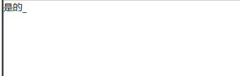

# 
好东西

`不限于 框架 / 结构 / 模式 / 钩子 / 兼容性 / 方法`

- 后端接口搭建 express + TS: `after-end-fundamental-frame-TS-Expres`
- MVVM 基础框架模式: `framework-MVVM`
- 模板渲染方法: `tpl-replace`
- 基础 webpack 框架搭建: `webpack-base`
- 一些方法碎片集锦: `something-good`

  - DOM-兼容性处理: [compat-DOM.js](./something-good/compat-DOM.js)
  - 深克隆: [deepClone.js](./something-good/deepClone.js)
  - 检查: [check.js](./something-good/check.js)
      

        
包含 

        1. os: 检查登录设备
      

  - 文字动画效果: [textAnimation.js](./something-good/textAnimation.js)
      

        
打字效果 

    
      

