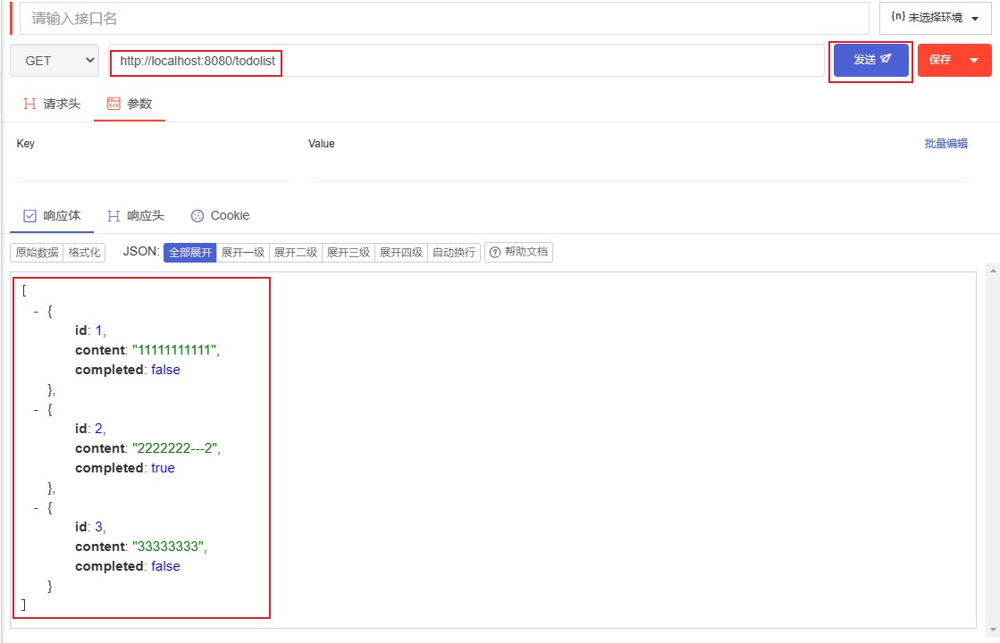

# 后端服务器基础框架搭建--Express / TS

`过程：文件准备 》app.ts 框架搭建 》数据文件准备 》类型文件 》封装读取文件内容方法`

### <center>前期准备</center>

##### 1. 安装依赖包

- `express`：后端框架
- `@types/express`：express `类型文件`
- `typescript`：ts
- `ts-node-dev：ts` 代码文件运行工具

```javascript
npm init -y //召唤出 ***package.json*** 文件
npm i express @types/express typescript ts-node-dev -D
```

##### 2. 文件准备

- `data.json`：数据
- `app.ts`：服务器框架
- `typings.ts`：类型文件
- `utils.ts`：保存方法的文件

```
|-- 根目录
    |-- node_modules
    |-- server
        |-- app.ts
        |-- data.json
        |-- typings.json
        |-- utils.ts
    |-- package.josn
```

##### 3. package.json 文件处理

```json
  "scripts": {
    "server": "ts-node-dev ./server/app.ts"  //运行 app.ts 代码
  },
```

[package.josn](./package.json)

### <center>项目搭建</center>

##### 4. 数据文件编辑

<details>
 <summary>data.json</summary>
 
 ```json
    [
        {
            "id":1,
            "content":"1111111111",
            "completed":false
        },
        {
            "id":2,
            "content":"2222222222",
            "completed":true
        },
        {
            "id":3,
            "content":"333333333333333",
            "completed":false
        }
    ]
```
[data.json](server/data.json)

</details>

##### 5. 类型文件编辑

<details>
 <summary>typings.ts</summary>

```typescript
export interface ITodo {
  id: number;
  content: string;
  completed: boolean;
}
```

[typings.ts](server/typings.ts)

</details>

##### 6. 封装读取文件内容函数

<details>
 <summary>utils.ts</summary>

```typescript
// 读取文件 API
import { readFileSync } from 'fs'; //同步读取数据文件：readFileSync(文件地址, 编码格式)
import { resolve } from 'path'; //地址信息拼接：resolve(当前地址, 文件名)、__dirname--当前文件路径

// 读取文件函数封装
export function readFile(fileName: string): string {
return readFileSync(resolve(\_\_dirname, fileName), 'utf-8');
}
```

[utils.ts](server/utils.ts)

</details>

##### 7. 后端框架搭建

<details>
 <summary>app.ts</summary>

```typescript
import express, { Application } from 'express'; //搭建服务器，****app类型？
import bodyParser from 'body-parser'; //处理 post 请求，解析请求端传递的值
import { readFile } from './utils'; // 自定义的 readFile 方法

// 创建 app 服务器
const app: Application = express();

// 编译请求信息
app.use(bodyParser.urlencoded({ extended: true }));
app.use(bodyParser.json());

// 跨域问题处理
app.all('_', (req, res, next) => {
  // 支持跨域请求
  res.header('Access-Control-Allow-Origin', '_');
  // \*\*\*\*支持跨方法请求？
  res.header('Access-Control-Allow', 'PUT,POST,GET,DELETE,OPTIONS');

  next();
});

// 请求方法
// GET
app.get('/todolist', (req, res) => {
  // 读取文件数据信息
  const data = readFile('data.json');

  // 返回给请求端
  res.send(data);

  // 访问地址测试：localhost:8080/todolist
});
app.post('/toggle', (req, res) => {});
app.post('/remove', (req, res) => {});
app.post('/add', (req, res) => {});

// 设置监听
app.listen(8080, () => {
  console.log('welcom to port 8080');
});
```

[app.ts](server/app.ts)

</details>

##### 8. GET 方法测试

    浏览器访问：`http://localhost:8080/todolist`

<details>
 <summary>测试结果</summary>



</details>
