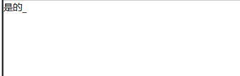

# 
方法盒

- DOM-兼容性处理: [compat-DOM.js](../something-good/compat-DOM.js)
- 深克隆: [deepClone.js](../something-good/deepClone.js)
- 检查: [check.js](../something-good/check.js)
    

      
包含 

      1. os: 检查登录设备
    

- 文字动画效果: [textAnimation.js](../something-good/textAnimation.js)
    

      
打字效果 

  
    

